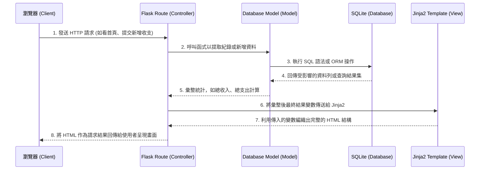

# 系統架構文件 (ARCHITECTURE) - 個人簿記系統

## 1. 技術架構說明
本專案採用經典的伺服器端渲染 (Server-Side Rendering, SSR) 模式來打造一個輕量級且直接的個人簿記 Web 應用程式。並未實施前後端分離，藉此維持系統的純粹並且降低多餘的互動介面層。

### 選用技術與原因
- **後端框架：Python + Flask**
  - **原因**：Flask 是一個微型 (Micro) 且具高度擴展性的後端框架。對於我們的個人記帳專案來說，比起龐大的框架，Flask 提供的單純路由與靈活套件整合更貼合輕量化簿記系統的需求，也能加速 MVP 的開發。
- **模板引擎：Jinja2**
  - **原因**：內建於 Flask。可以讓我們輕鬆地將 Python 處理好的資料（如：支出紀錄列表、總額數字）動態帶入 HTML 中顯示。讓頁面渲染統一由後端掌管，免除實作繁雜的前端資料獲取邏輯。
- **資料庫：SQLite**
  - **原因**：它是一種檔案型資料庫，輕量且不需要設定與啟動資料庫伺服器。對個人的收支資料儲存來說效能已經非常足夠，並且在專案轉移與備份上極具優勢（只需維護一個檔案）。

### MVC 模式對應說明
為了維護程式碼的可讀性，我們會將專案依循 MVC 的理念劃分檔案職責：
- **Model（模型）**：專門負責向 SQLite 進行資料的存取與變更（CRUD）。
- **View（視圖）**：由 Jinja2 配合 HTML 所建立的模板，負責畫面的靜態架構與動態資料顯示。
- **Controller（控制器）**：定義於 Flask 路由的邏輯中。擔任 Model 跟 View 之間溝通的橋樑，處理用戶的網路請求 HTTP Request、調用 Model 計算分析資料，最後交給 View 來生合成網頁。

---

## 2. 專案資料夾結構
為了支援 MVC 且方便日後維護，本專案的目錄結構安排如下：

```text
web_app_development/
├── app/
│   ├── __init__.py      # Flask 應用程式初始化與配置設定
│   ├── models.py        # 資料庫模型結構及資料互動與操作邏輯 (Model)
│   ├── routes.py        # 應用程式的詳細網站路由與處理邏輯 (Controller)
│   ├── templates/       # 所有的 Jinja2 HTML 模板檔案 (View)
│   │   ├── base.html    # 共用的網頁排版與共通載入資源 (Navigator/Footer)
│   │   ├── index.html   # 首頁明細清單與結餘總結
│   │   └── form.html    # 新增及編輯紀錄專用的輔助表單頁面
│   └── static/          # 供前端網頁使用的靜態資源
│       ├── css/
│       │   └── style.css# 負責畫面的配色、版面等視覺調整
│       └── js/
│           └── main.js  # 若有圖表需求或簡單自訂行為可放置於此
├── instance/
│   └── database.db      # SQLite 資料庫檔案實體（建議放入 .gitignore）
├── docs/
│   ├── PRD.md           # 產品需求文件
│   └── ARCHITECTURE.md  # 系統架構說明書（本文件）
├── requirements.txt     # 記載 Python 的外部函式庫套件版本
└── run.py               # 專案服務啟動入口
```

---

## 3. 元件關係圖
使用者與各重點模組之間的資料與控制流圖解：



---

## 4. 關鍵設計決策
1. **整體規劃採用純後端 SSR 渲染**
   - **原因**：雖然以 API + 前端框架（React/Vue）為主流，但我們的簿記系統需求為輕便迅速，沒有複雜的即時操作。採用 SSR 可將架構簡化至最低，單兵作戰開發也能大幅降低除錯與跨頻溝通的成本，頁面載入速度反而更佳。
2. **工整實施 MVC 切分檔案**
   - **原因**：新手寫 Flask 容易將所有的資料庫指令與路由邏輯全部擠在單一的 `app.py` 中。藉由拆分 `models.py` 與 `routes.py` 可以大幅提升程式碼找尋效率並方便擴展（例如單獨針對 model 做單元測試）。
3. **選擇 SQLite 以符合輕量理念**
   - **原因**：一般的資料庫伺服器建置與連線步驟繁瑣，對於「個人」管理為主的系統來說有些殺雞用牛刀。選擇單一檔案即可運作的 SQLite，使此系統在佈署或移植到其它電腦觀看時擁有極高的彈性。
