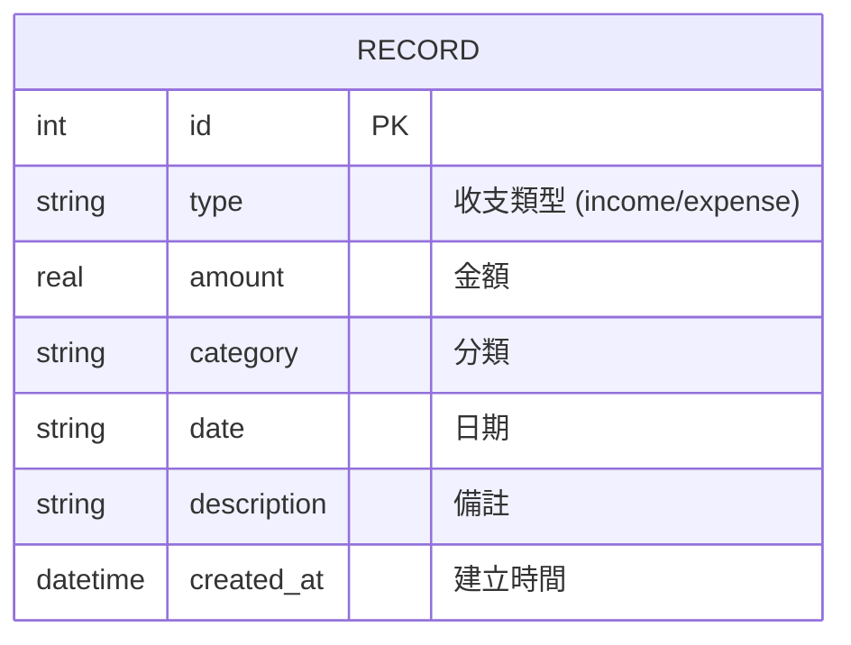

# 資料庫設計文件 (Database Design)

本文件依據 PRD 與架構設計，定義「個人簿記系統」的資料庫結構與 Python Model 設計。

## 1. ER 圖（實體關係圖）



## 2. 資料表詳細說明

### `records` 資料表

負責儲存使用者所有的收入與支出紀錄，是系統最核心且唯一的資料表。

| 欄位名稱 | 型別 | 必填 | 說明 |
| --- | --- | --- | --- |
| `id` | INTEGER | 是 | 紀錄的唯一識別碼 (Primary Key)，自動遞增 |
| `type` | TEXT | 是 | 收支類型，值為 `income` (收入) 或 `expense` (支出) |
| `amount` | REAL | 是 | 收支金額，為了未來支援小數儲存而使用 REAL，單純整數亦可 |
| `category` | TEXT | 是 | 交易分類 (例如：飲食、交通、薪水) |
| `date` | TEXT | 是 | 交易發生的日期，通常儲存為 `YYYY-MM-DD` 格式 |
| `description` | TEXT | 否 | 紀錄的備註或額外說明 |
| `created_at` | DATETIME | 是 | 系統預設帶入的建立時間戳記 (預設值為 `CURRENT_TIMESTAMP`) |

## 3. SQL 建表語法

完整的建表語法，亦儲存於 `database/schema.sql` 供後續初始化資料庫時使用。

```sql
CREATE TABLE IF NOT EXISTS records (
    id INTEGER PRIMARY KEY AUTOINCREMENT,
    type TEXT NOT NULL,
    amount REAL NOT NULL,
    category TEXT NOT NULL,
    date TEXT NOT NULL,
    description TEXT,
    created_at DATETIME DEFAULT CURRENT_TIMESTAMP
);
```

## 4. Python Model 程式碼規劃

對應於 `app/models/record.py` 中的 `RecordModel` 類別，提供基礎的 CRUD 操作。
- `create(type, amount, category, date, description)`: 新增一筆紀錄
- `get_all()`: 取得所有紀錄並依日期與 ID 排序（新到舊）
- `get_by_id(record_id)`: 利用 ID 取得單一筆紀錄
- `update(record_id, type, amount, category, date, description)`: 更新指定 ID 的紀錄
- `delete(record_id)`: 刪除指定 ID 的紀錄
