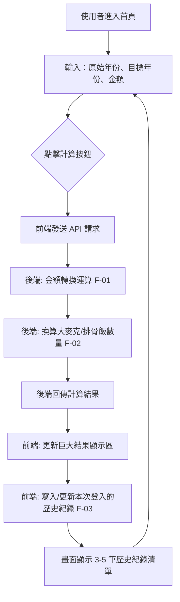
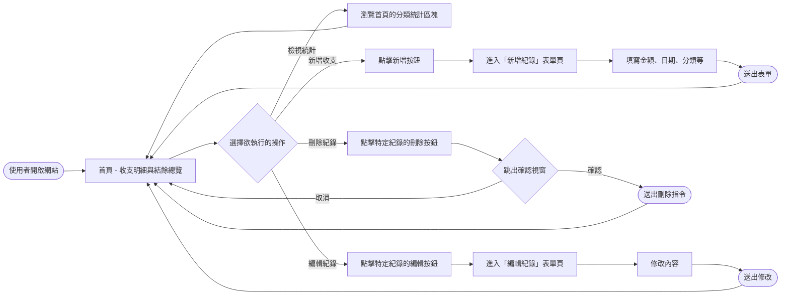
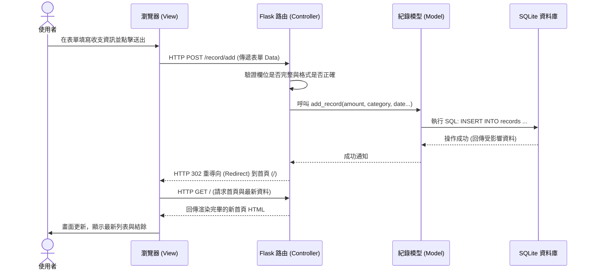

<<<<<<< HEAD
# 使用者與系統流程圖

=======
# 使用者與系統流程圖 (FLOWCHART)

本文件依據 PRD 與架構設計，繪製了「個人簿記系統」的操作路徑以及背後資料流動的關係，方便確保各個環節沒有遺漏。

## 1. 使用者流程圖（User Flow）

描述使用者從進入網站開始，一直到完成每一項任務（如新增、編輯、刪除收支等）的瀏覽路徑與選項。

## 2. 系統序列圖（Sequence Diagram）

以下描繪使用者進行「新增一筆收支紀錄」時，從瀏覽器到 Flask 伺服器再到資料庫的詳細溝通序列。

## 3. 功能清單與路由對照表

開發時將依照以下對應表格來建置 Flask 路由，涵蓋目前 MVP 階段中所有的必須功能操作。

| 功能描述 | URL 路徑 | HTTP 方法 | 備註說明 |
| --- | --- | --- | --- |
| 顯示首頁 (明細與總結) | `/` | GET | 從 Model 取得所有紀錄，計算總收支並呈現列表 |
| 新增紀錄表單頁面 | `/record/add` | GET | 呈現一個空白的 HTML 表單元件 |
| 接收並處理新增紀錄 | `/record/add` | POST | 接收表單發送的字典資料，寫入資料庫後 Redirect |
| 編輯紀錄表單頁面 | `/record/edit/<int:id>` | GET | 以 id 取出該紀錄原有資料，填補進表單供使用者修改 |
| 接收並處理編輯紀錄 | `/record/edit/<int:id>` | POST | 接收修改後的表單資料，更新資料庫紀錄並 Redirect |
| 接收並處理刪除紀錄 | `/record/delete/<int:id>`| POST | （通常透過隱藏表單送出）從資料庫刪除紀錄並 Redirect |

>>>>>>> 363dcaa7c992d8f9048f739053a6f9344920de7b
