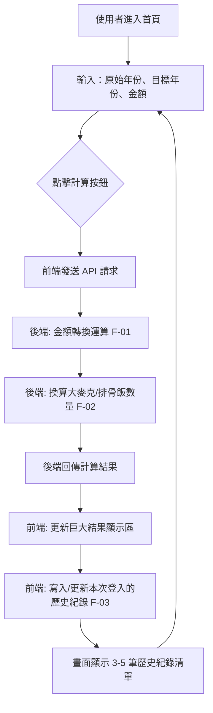

# 使用者與系統流程圖

```mermaid
graph TD
    A[使用者進入首頁] --> B[輸入：原始年份、目標年份、金額]
    B --> C{點擊計算按鈕}
    C --> D[前端發送 API 請求]
    D --> E[後端: 金額轉換運算 F-01]
    E --> F[後端: 換算大麥克/排骨飯數量 F-02]
    F --> G[後端回傳計算結果]
    G --> H[前端: 更新巨大結果顯示區]
    H --> I[前端: 寫入/更新本次登入的歷史紀錄 F-03]
    I --> J[畫面顯示 3-5 筆歷史紀錄清單]
    J --> B
```
